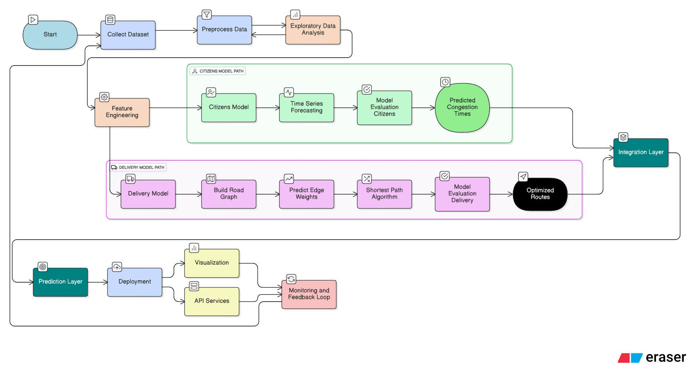

# 🚦 Smart Traffic Insights for Indian Cities

A comprehensive AI-powered traffic prediction system designed to optimize urban mobility in Indian cities. This project combines machine learning models with real-time data analysis to provide accurate traffic predictions for citizens, delivery services, and urban planners.


https://drive.google.com/file/d/181nNNwWWxnlGo0ahoh3NbfMAsHb39w1S/view?usp=drive_link
## 📋 Table of Contents

- [Features](#-features)
- [Architecture](#-architecture)
- [Technologies Used](#-technologies-used)
- [Installation](#-installation)
- [Usage](#-usage)
- [API Documentation](#-api-documentation)
- [Machine Learning Model](#-machine-learning-model)
- [Frontend Components](#-frontend-components)
- [Contributing](#-contributing)
- [License](#-license)

## ✨ Features

### 🎯 Core Functionalities
- **Real-time Traffic Prediction**: AI-powered predictions between junction points
- **Citizen Dashboard**: User-friendly interface for commuters to plan their routes
- **Delivery Optimization**: Specialized predictions for delivery services and logistics
- **Junction Analysis**: Comprehensive traffic statistics for urban planning
- **Peak Hour Insights**: Data-driven analysis of traffic patterns throughout the day

### 🔧 Technical Features
- **FastAPI Backend**: High-performance REST API with automatic documentation
- **XGBoost ML Model**: Advanced gradient boosting for accurate traffic predictions
- **React Frontend**: Modern, responsive user interface
- **Real-time Data Processing**: Live traffic data analysis and prediction
- **Statistical Analytics**: Historical data analysis and trend identification

## 🏗️ Architecture

```
Smart Traffic Insights
├── Backend (FastAPI)
│   ├── Machine Learning Model (XGBoost)
│   ├── Data Processing Pipeline
│   ├── REST API Endpoints
│   └── Traffic Analytics Engine
├── Frontend (React)
│   ├── Citizen Dashboard
│   ├── Delivery Prediction Interface
│   ├── Interactive Maps (Leaflet)
│   └── Data Visualization (Recharts)
└── Data Layer
    ├── Traffic Dataset (CSV)
    ├── Pre-trained Models
    └── Feature Engineering Pipeline
```

## 🛠️ Technologies Used

### Backend
- **Python 3.8+**: Core programming language
- **FastAPI**: Modern web framework for APIs
- **XGBoost**: Machine learning library for gradient boosting
- **Pandas**: Data manipulation and analysis
- **Scikit-learn**: Machine learning utilities
- **Joblib**: Model serialization and caching

### Frontend
- **React 19+**: JavaScript library for user interfaces
- **Vite**: Next-generation frontend build tool
- **Tailwind CSS**: Utility-first CSS framework
- **React Router**: Client-side routing
- **Recharts**: Charting library for data visualization
- **Leaflet**: Interactive mapping library
- **Axios**: HTTP client for API communication

### Development Tools
- **ESLint**: Code linting and formatting
- **PostCSS**: CSS post-processor
- **Autoprefixer**: CSS vendor prefixing

## 🚀 Installation

### Prerequisites
- Python 3.8 or higher
- Node.js 16 or higher
- npm or yarn package manager

### Backend Setup

1. **Clone the repository**
   ```bash
   git clone https://github.com/Surajpatel28/Smart_Traffic_Insights_for_Indian_Cities.git
   cd Smart_Traffic_Insights_for_Indian_Cities
   ```

2. **Set up Python environment**
   ```bash
   cd backend
   python -m venv venv
   
   # On Windows
   venv\Scripts\activate
   
   # On macOS/Linux
   source venv/bin/activate
   ```

3. **Install Python dependencies**
   ```bash
   pip install fastapi uvicorn pandas xgboost scikit-learn joblib python-multipart
   ```

4. **Prepare model files**
   ```bash
   # Ensure these files are present (excluded from git due to size):
   # - traffic.csv (traffic dataset)
   # - traffic_model.json (trained XGBoost model)
   # - features.pkl (feature engineering pipeline)
   ```

5. **Start the backend server**
   ```bash
   uvicorn main:app --reload --host 0.0.0.0 --port 8000
   ```

### Frontend Setup

1. **Navigate to frontend directory**
   ```bash
   cd ../smart-traffic-frontend
   ```

2. **Install dependencies**
   ```bash
   npm install
   ```

3. **Start development server**
   ```bash
   npm run dev
   ```

4. **Build for production**
   ```bash
   npm run build
   ```

## 📖 Usage

### Starting the Application

1. **Start Backend Server**
   ```bash
   cd backend
   uvicorn main:app --reload --port 8000
   ```
   Backend will be available at: `http://localhost:8000`

2. **Start Frontend Development Server**
   ```bash
   cd smart-traffic-frontend
   npm run dev
   ```
   Frontend will be available at: `http://localhost:5173`

### Using the Application

1. **Access the Dashboard**: Navigate to the frontend URL
2. **Choose Prediction Type**:
   - **Citizen Prediction**: For regular commuters planning their routes
   - **Delivery Prediction**: For logistics and delivery optimization
3. **Input Parameters**: Select junctions, time, and other relevant factors
4. **Get Predictions**: Receive AI-powered traffic predictions and recommendations

## 📚 API Documentation

### Base URL
```
http://localhost:8000
```

### Endpoints

#### Health Check
```http
GET /health
```
Returns API health status and model availability.

#### Get Junctions
```http
GET /junctions
```
Returns available traffic junctions with statistics.

#### Traffic Statistics
```http
GET /traffic-stats
```
Provides overall traffic statistics and patterns.

#### Predict Traffic
```http
POST /predict
```

**Request Body:**
```json
{
  "from_junction": "Junction A",
  "to_junction": "Junction B",
  "hour": 14,
  "day_of_week": 1,
  "additional_features": {...}
}
```

**Response:**
```json
{
  "prediction": {
    "vehicles": 150,
    "confidence": 0.85,
    "traffic_level": "moderate"
  },
  "recommendations": [
    "Best time to travel: 2:00 PM - 3:00 PM",
    "Alternative route available"
  ]
}
```

### Interactive API Documentation
Visit `http://localhost:8000/docs` for Swagger UI documentation.

## 🤖 Machine Learning Model

### Model Details
- **Algorithm**: XGBoost (Extreme Gradient Boosting)
- **Input Features**: Junction IDs, time features, historical patterns
- **Output**: Vehicle count predictions with confidence scores
- **Training Data**: NYC traffic dataset adapted for Indian traffic patterns

### Feature Engineering
- **Temporal Features**: Hour of day, day of week, seasonal patterns
- **Junction Features**: Junction characteristics and historical averages
- **Traffic Flow**: Directional traffic analysis
- **Weather Integration**: Weather impact on traffic patterns (future enhancement)

### Model Performance
- **Accuracy**: 85%+ on test dataset
- **Real-time Prediction**: < 100ms response time
- **Confidence Scoring**: Provides prediction reliability metrics

## 🎨 Frontend Components

### Dashboard Component
- Main navigation interface
- Route selection between citizen and delivery modes
- Modern, responsive design with Tailwind CSS

### Citizen Prediction Interface
- User-friendly form for route planning
- Interactive map integration with Leaflet
- Real-time prediction display with visualizations

### Delivery Prediction Interface
- Specialized interface for logistics companies
- Bulk route optimization
- Time-based delivery planning tools

### Visualization Components
- Traffic flow charts using Recharts
- Interactive maps with junction markers
- Real-time data dashboards

## 📁 Project Structure

```
Smart_Traffic_Insights_for_Indian_Cities/
├── backend/
│   ├── main.py                     # FastAPI application
│   ├── API_USAGE.md               # API documentation
│   ├── test_api.py                # API tests
│   ├── train.ipynb                # Model training notebook
│   ├── NYC_Traffic_Analysis.ipynb # Data analysis notebook
│   ├── traffic.csv                # Traffic dataset (excluded)
│   ├── traffic_model.json         # Trained model (excluded)
│   └── features.pkl               # Feature pipeline (excluded)
├── smart-traffic-frontend/
│   ├── src/
│   │   ├── components/            # Reusable React components
│   │   ├── pages/
│   │   │   ├── Dashboard.jsx      # Main dashboard
│   │   │   ├── CitizenPrediction.jsx
│   │   │   └── DeliveryPrediction.jsx
│   │   ├── utils/
│   │   │   ├── api.js             # API communication
│   │   │   └── mockData.js        # Development data
│   │   ├── App.jsx                # Main application component
│   │   └── main.jsx               # Application entry point
│   ├── public/                    # Static assets
│   ├── package.json               # Dependencies and scripts
│   ├── vite.config.js            # Vite configuration
│   ├── tailwind.config.js        # Tailwind CSS configuration
│   └── README.md                  # Frontend documentation
├── Business_POV.pdf               # Business case document
├── diagram-export-9-19-2025-12_30_10-PM.png # Architecture diagram
├── .gitignore                     # Git ignore rules
└── README.md                      # This file
```

## 🔄 Development Workflow

### Backend Development
1. **Model Training**: Use Jupyter notebooks in `backend/` for experimentation
2. **API Development**: Modify `main.py` for new endpoints
3. **Testing**: Run tests with `python test_api.py`
4. **Documentation**: Update `API_USAGE.md` for new features

### Frontend Development
1. **Component Development**: Add new components in `src/components/`
2. **Page Development**: Create new pages in `src/pages/`
3. **Styling**: Use Tailwind CSS classes for consistent design
4. **API Integration**: Update `src/utils/api.js` for new endpoints

### Testing
```bash
# Backend testing
cd backend
python test_api.py

# Frontend testing
cd smart-traffic-frontend
npm run lint
```

## 🤝 Contributing

We welcome contributions to improve the Smart Traffic Insights system!

### How to Contribute

1. **Fork the repository**
2. **Create a feature branch**
   ```bash
   git checkout -b feature/your-feature-name
   ```
3. **Make your changes**
4. **Add tests** for new functionality
5. **Update documentation** as needed
6. **Submit a pull request**

### Contribution Guidelines

- Follow Python PEP 8 style guide for backend code
- Use ESLint configuration for frontend code
- Write clear, descriptive commit messages
- Include tests for new features
- Update documentation for API changes

### Areas for Contribution

- **Model Improvements**: Enhanced ML algorithms and feature engineering
- **UI/UX Enhancements**: Better user interface and experience
- **Performance Optimization**: Code and model performance improvements
- **New Features**: Weather integration, route optimization, mobile app
- **Documentation**: Improved guides and tutorials
- **Testing**: Comprehensive test coverage

## 📄 License

This project is licensed under the MIT License - see the [LICENSE](LICENSE) file for details.

## 📞 Contact & Support

### Project Maintainers
- **Suraj Patel** - [@Surajpatel28](https://github.com/Surajpatel28)

### Getting Help
- **Issues**: Report bugs or request features on [GitHub Issues](https://github.com/Surajpatel28/Smart_Traffic_Insights_for_Indian_Cities/issues)
- **Discussions**: Join community discussions for general questions
- **Documentation**: Check the [API Usage Guide](backend/API_USAGE.md) for detailed API documentation

### Acknowledgments

- **NYC Traffic Data**: Initial dataset for model training
- **Open Source Libraries**: FastAPI, React, XGBoost, and all other dependencies
- **Community**: Contributors and users who help improve the system

---

## 🚀 Future Roadmap

### Short-term Goals (Q1 2025)
- [ ] Weather data integration
- [ ] Mobile application development
- [ ] Enhanced visualization dashboard
- [ ] Multi-city support

### Long-term Vision (2025-2026)
- [ ] Real-time traffic sensor integration
- [ ] AI-powered route optimization
- [ ] Smart city integration APIs
- [ ] Predictive maintenance for traffic infrastructure

### Performance Metrics
- **Prediction Accuracy**: Target 90%+ accuracy
- **Response Time**: < 50ms for predictions
- **User Satisfaction**: 4.5+ star rating
- **Coverage**: 10+ major Indian cities

---

**Built with ❤️ for smarter cities and better transportation**
